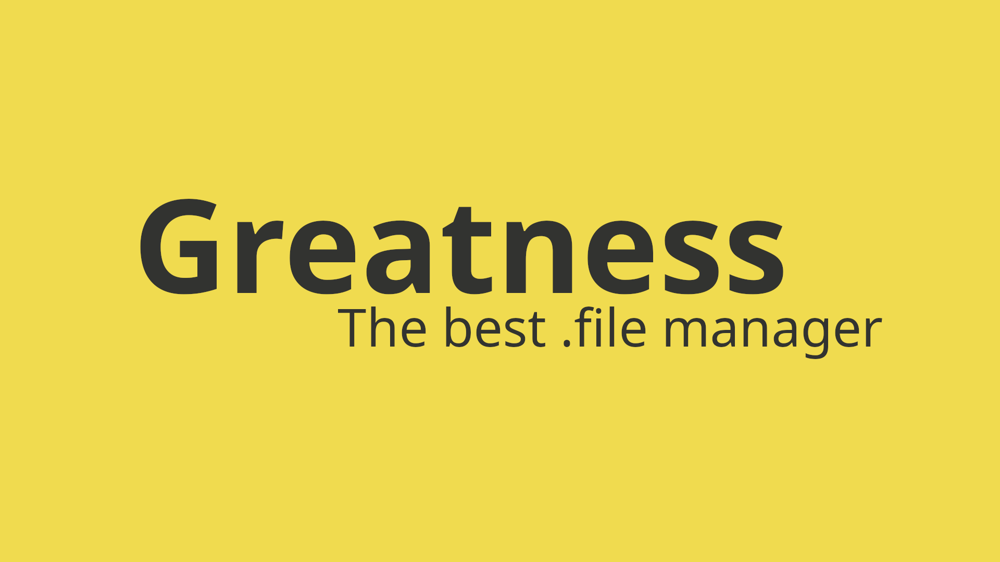

# Greatness!
<p align="center">
  <a href="github.com/IsaccBarker/Greatness" target="blank"></a>
</p>
Achieve it! How you ask? Well, it's pretty simple; just use greatness!

## Install greatness
```bash
# Only run this if you don't have rust installed.
curl --proto '=https' --tlsv1.2 -sSf https://sh.rustup.rs | sh

# Inside the cloned repo
cargo install
```

## What is greatness?
Greatness is you being great and better than everyone else. You have to uphold that superoprity complex don't you?

## How do I achieve greatness?
Simple! Use this tool. This tool is designed to bring your system up to a working state that you like in a small amount of time. It is *very* flexible, 100% modular, and fast.

You can view the documentation [here](docs/SUMMARY.md)!

## Why is Greatness *the* best?
Well, just remember the name. Greatness has to be the best. But if you are stupid (but still great), here is a comparision chart.  
#### Disclaimer
You may recognise this chart from Chezmoi, but with some rows stripped out. This is because I do not know what they mean, and thus cannot implement them. If you want them, please file a great issue/pr.

|                                        | greatness         | chezmoi       | dotbot            | rcm               | homesick          | yadm          | bare git   |
| -------------------------------------- | ----------------- | ------------- | ----------------- | ----------------- | ----------------- | ------------- | ---------- |
| Distribution                           | Source/Binary     | Single binary | Python package    | Multiple files    | Ruby gem          | Single script | n/a        |
| Install method                         | Many              | Many          | git submodule     | Many              | Ruby gem          | Many          | Manual     |
| Non-root install on bare system        | ✅                | ✅            | Difficult         | Difficult         | Difficult         | ✅            | ✅         |
| Windows support                        | ❌                | ✅            | ❌                | ❌                | ❌                | ❌            | ✅         |
| Bootstrap requirements                 | Rust, automatic   | Go, automatic | Python, git       | Perl, git         | Ruby, git         | git           | git        |
| Source repos                           | Single            | Single        | Single            | Multiple          | Single            | Single        | Single     |
| dotfiles are...                        | Files             | Files         | Symlinks          | Files             | Symlinks          | Files         | Files      |
| Config file                            | Required, Managed | Optional      | Required          | Optional          | None              | None          | Optional   |
| Show differences without applying      | ✅                | ✅            | ❌                | ❌                | ❌                | ✅            | ✅         |
| Password manager integration           | ❓                | ✅            | ❌                | ❌                | ❌                | ❌            | ❌         |
| Machine-to-machine file differences    | Scripting         | Templates     | Alternative files | Alternative files | Alternative files | Templates     | Manual     |
| Custom variables in templates          | ✅                | ✅            | ❌                | ❌                | ❌                | ❌            | ❌         |
| Dotfile Merging                        | ✅                | ❌            | ❌                | ❌                | ❌                | ❌            | ❌         |
| Scriptable                             | ✅                | ❌            | ❌                | ❌                | ❌                | ❌            | ❌         |
| Modular                                | ✅                | ❌            | ❌                | ❌                | ❌                | ❌            | ❌         |
| Executable files                       | ✅                | ✅            | ✅                | ✅                | ✅                | ❌            | ✅         |
| Run scripts                            | ✅                | ✅            | ✅                | ✅                | ❌                | ❌            | ❌         |
| Run once scripts                       | ✅                | ✅            | ❌                | ❌                | ❌                | ❌            | ❌         |
| Machine-to-machine symlink differences | ✅                | ✅            | ❌                | ❌                | ❌                | ✅            | ❌         |
| File Tagging                           | ✅                | ❌            | ❌                | ❌                | ❌                | ❌            | ❌         |
| Shell completion                       | ✅                | ✅            | ❌                | ❌                | ❌                | ✅            | ✅         |
| Archive import                         | ✅                | ✅            | ❌                | ❌                | ❌                | ❌            | ❌         |
| Archive export                         | ✅                | ✅            | ❌                | ❌                | ❌                | ❌            | ✅         |
| Implementation language                | Rust, Rhai        | Go            | Python            | Perl              | Ruby              | Bash          | C          |

As you can see, greatness is best. However, a sort of close second [chezmoi], has a weird name, is not scriptable, doesn't support dotfile merging, and isn't modular. This makes it not ideal for situations where you might want to pick parts of diferent peoples rices, merge them, script program installation (or have greatness do it for you), and then put it out into the world as a repository, which other people can then use as modules.

### But don't use Windows. There are four reasons for this
1. The use case is really small (not many people develop on Windows to the point where you need a dotfile manager).
2. Windows is not great.
3. It's very diferent than MacOS and Unix, where most development happens.
4. I don't have a Windows machine.
Windows support may or may not be added in the future. The underlying code for supporting Windows is added to the best of my ability, but overall it should not work. Please note that not providing Windows support is mainly for your safety; I would hate for anything bad to happen to your files.

